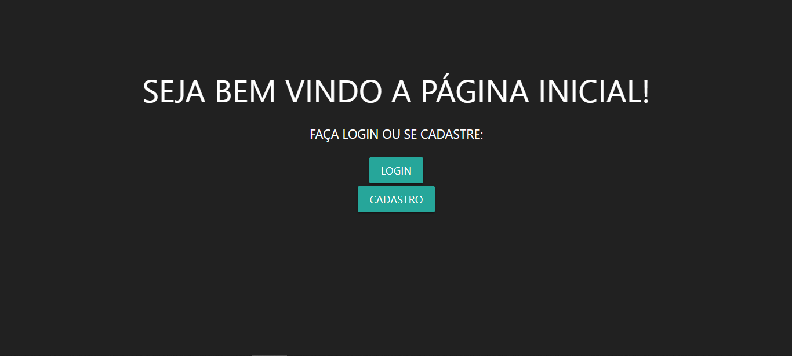
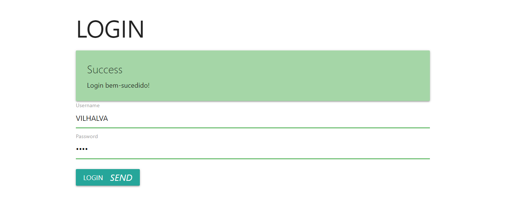
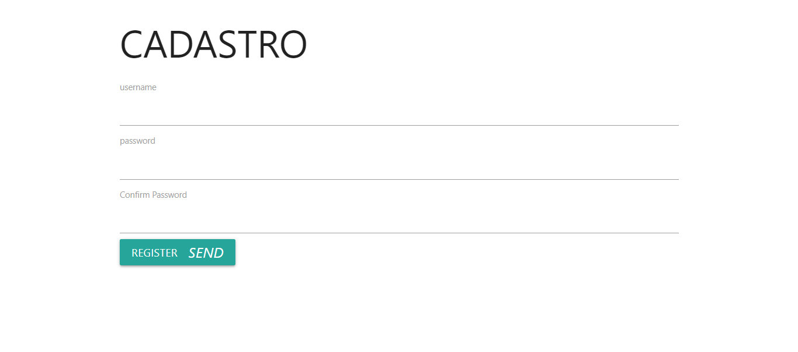
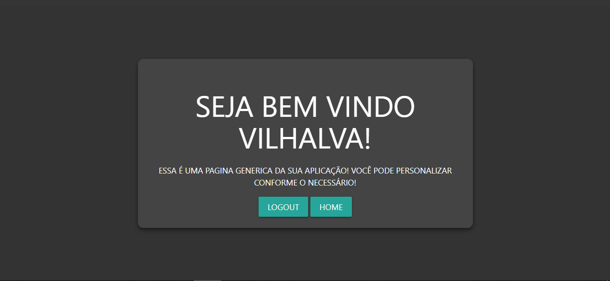
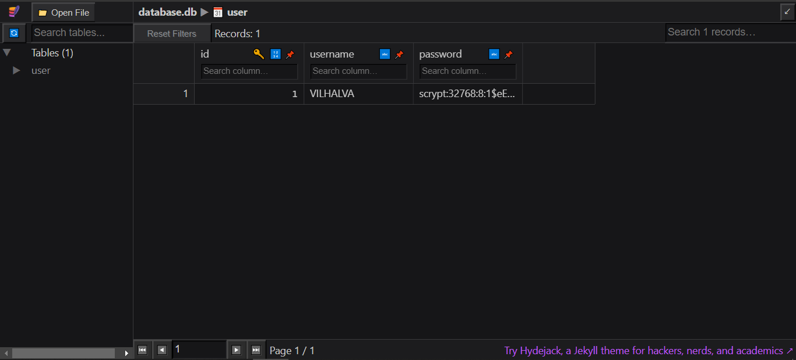

# FORMULARIO COM FLASK
👨‍🏫FORMULARIO DE CADASTRO E LOGIN COM FLASK E SQLITE!

 <br> 
 <br> 
 <br> 
 <br> 
 <br> 

## DESCRIÇÃO:
Este aplicativo é um sistema de autenticação básico desenvolvido usando o framework Flask em Python. Aqui está uma descrição do que ele faz:

1. **Autenticação de Usuário**:
   - Permite que os usuários se cadastrem e façam login.
   - Senhas dos usuários são armazenadas no banco de dados de forma criptografada usando a função `generate_password_hash` do Werkzeug.
   - Verifica as credenciais do usuário no login usando a função `check_password_hash` para validar a senha fornecida.

2. **Funcionalidades Principais**:
   - **Cadastro de Usuário**: Os usuários podem se cadastrar fornecendo um nome de usuário e uma senha.
   - **Login de Usuário**: Os usuários podem fazer login usando o nome de usuário e a senha cadastrados.
   - **Logout de Usuário**: Os usuários podem fazer logout, encerrando a sessão atual.
   - **Persistência de Sessão**: Usa o objeto `session` do Flask para manter o estado da sessão do usuário entre diferentes requisições.

3. **Armazenamento de Dados**:
   - Utiliza o banco de dados SQLite para armazenar informações do usuário, como nome de usuário e senha. Fica em `./CODIGO/instance/database.db`.
   - Usa o SQLAlchemy como ORM (Object-Relational Mapping) para interagir com o banco de dados.

## SOBRE O FLASK:
1. **Descrição do `app`**:
   - O `app` é uma instância da classe `Flask`, que é o ponto central de uma aplicação Flask.
   - Ele contém todas as configurações, rotas e lógica de negócios da aplicação.

2. **Componentes principais**:
   - **Rotas**: São URLs que a aplicação irá responder. Cada rota é mapeada para uma função de visualização que processa a requisição e retorna uma resposta.
   - **Formulários**: Usados para coletar dados do usuário, validar e processar esses dados.
   - **Banco de Dados**: Nesse caso, usei o SQLAlchemy para interagir com um banco de dados SQLite. Ele nos permite definir modelos de dados (como a classe `User`).

3. **Estrutura do código**:
   - O código geralmente é organizado em diferentes arquivos para separar as preocupações. Por exemplo, temos arquivos para as rotas (`app.py`), formulários (`forms.py`), e arquivos HTML para os templates.
   - O Flask segue o padrão MVC (Model-View-Controller), onde os modelos representam os dados, as visualizações (rotas) controlam a lógica da aplicação e os templates (views) lidam com a apresentação dos dados.

## EXECUTANDO O PROJETO:
1. **Instalando as dependências:**
   - Antes de executar o aplicativo, certifique-se de instalar todas as dependências necessárias. No terminal, execute o seguinte comando para instalar as dependências listadas no arquivo `requirements.txt` no diretório: `CODIGO`:
   ```bash
   pip install -r requirements.txt
   ```
   - Isso instruirá o pip a ler o arquivo requirements.txt e instalar todas as dependências listadas.

2. **Executando o Aplicativo:**
   - Em seguida, execute o seguinte comando para iniciar o servidor Flask:
   ```bash
   python app.py
   ```
   - Uma vez que o servidor esteja em execução, você poderá acessar o aplicativo através do seu navegador, visitando o seguinte endereço: `http://localhost:5000/`.
   
3. **Interagindo com o Aplicativo:**
   - **Navegar nas rotas**: Depois de executar a aplicação, você pode acessar as diferentes rotas no navegador. Por exemplo, `http://localhost:5000/` irá te levar para a página inicial.
   - **Interagir com a aplicação**: Você pode interagir com os formulários (como o de login e registro) para testar a funcionalidade da aplicação.
   - **Fazendo o Login:** Você pode fazer o login com `username=VILHALVA` e `password=1234`.
   - **Customização**: Você pode personalizar a aplicação alterando os arquivos HTML, adicionando novas rotas, criando novos modelos de dados, etc.

## TECNOLOGIAS USADAS:
1. [**Python**:](https://github.com/VILHALVA/CURSO-DE-PYTHON) Python é uma linguagem de Programação.

2. [**Flask**:](https://github.com/VILHALVA/CURSO-DE-FLASK) Flask é um framework web leve em Python que facilita a criação de aplicativos web. Ele fornece recursos essenciais para desenvolver aplicativos web, como roteamento de URL, gerenciamento de sessão e suporte a templates.

3. [**SQLAlchemy**:](https://flask-sqlalchemy.palletsprojects.com) SQLAlchemy é uma biblioteca ORM (Object-Relational Mapping) em Python que fornece uma maneira de interagir com bancos de dados relacionais de forma orientada a objetos. Ele simplifica a manipulação e a consulta de dados do banco de dados, fornecendo uma abstração de alto nível sobre o SQL.

4. [**Werkzeug**:](https://werkzeug.palletsprojects.com/) Werkzeug é uma biblioteca WSGI (Web Server Gateway Interface) em Python que fornece utilitários para lidar com solicitações HTTP, autenticação, segurança e outros aspectos do desenvolvimento web.

5. [**SQLite**:](https://github.com/VILHALVA/CURSO-DE-SQLITE) SQLite é um banco de dados SQL embutido que não requer um servidor separado. Ele é amplamente utilizado para desenvolvimento local e pequenos aplicativos web devido à sua simplicidade e facilidade de uso.

6. [**Python com SQLITE**:](https://github.com/VILHALVA/CURSO-DE-PYTHON-COM-SQLITE) Python é uma linguagem de Programação, enquanto SQLite é um banco de dados.

7. [**HTML e CSS**:](https://github.com/VILHALVA/CURSO-DE-HTML-E-CSS) HTML (Hypertext Markup Language) é a linguagem de marcação usada para estruturar o conteúdo de uma página web, enquanto CSS (Cascading Style Sheets) é usada para estilizar a aparência da página. No aplicativo, templates HTML são usados para renderizar as páginas web e o CSS é utilizado para estilizá-las.

8. [**Jinja2**:](https://jinja.palletsprojects.com/) Jinja2 é um mecanismo de template em Python usado pelo Flask para renderizar os templates HTML. Ele fornece recursos poderosos, como herança de templates, expressões condicionais e loops, para criar templates dinâmicos.

8. [**MATERIALIZECSS:**](https://github.com/VILHALVA/CURSO-DE-MATERIALIZECSS) Um framework front-end popular para desenvolvimento de interfaces de usuário responsivas e estilizadas.

## CREDITOS:
- [PROJETO CRIADO PELO VILHALVA](https://github.com/VILHALVA)


